# BioMed Executive Intelligence

Visual Homologation Preview — EXEC-02 / EXEC-02A

- **Branch:** `feat/executive-intelligence-redesign`
- **HEAD:** `506da9c8d94042c6bf64952ea2b9b599017c97e9`
- **PR:** #13
- **Data:** 2026-08-07
- **Fonte:** screenshots reais (`homolog_*.png`) — sem mockups artificiais

## Command Center Desktop

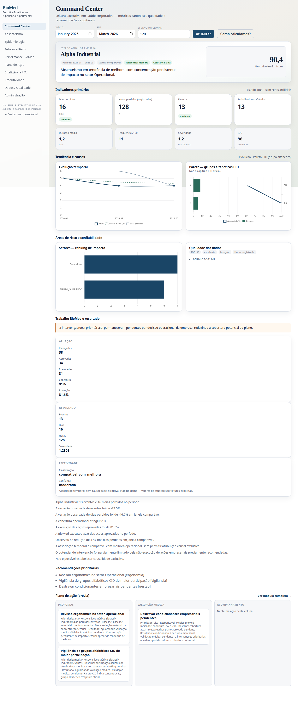

*Arquivo: `homolog_command_1440x900.png`*

---

## Command Center Mobile

*Arquivo: `homolog_command_390x844.png`*

---

## Performance BioMed

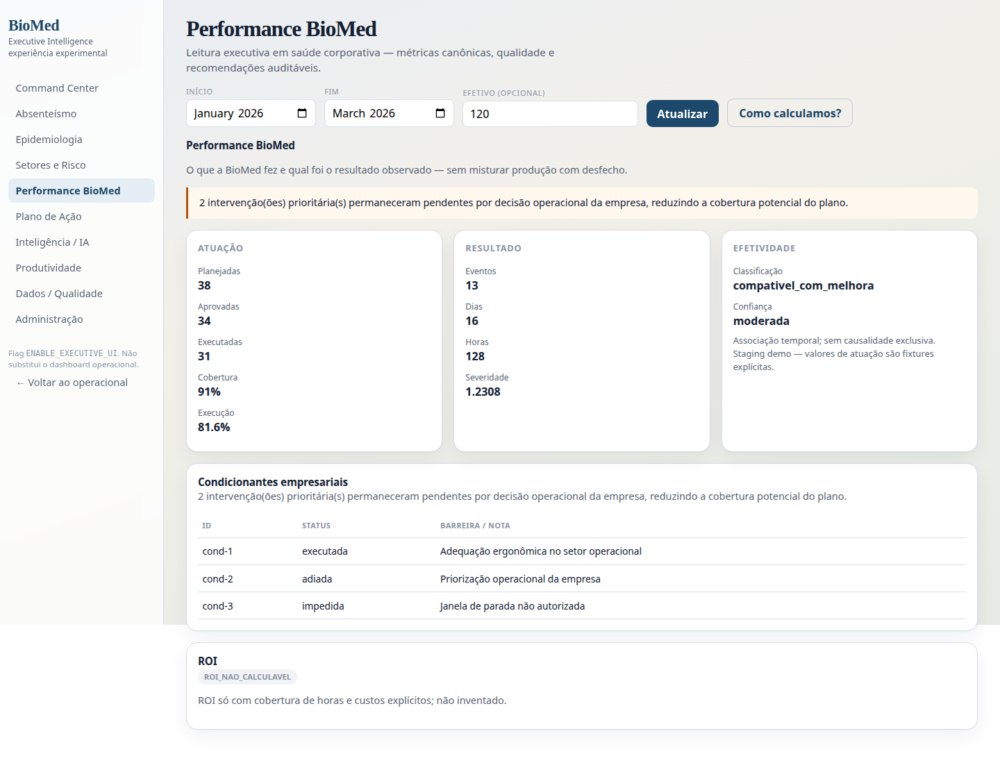

*Arquivo: `homolog_module_performance_1440x900.png`*

---

## BioMed Intelligence

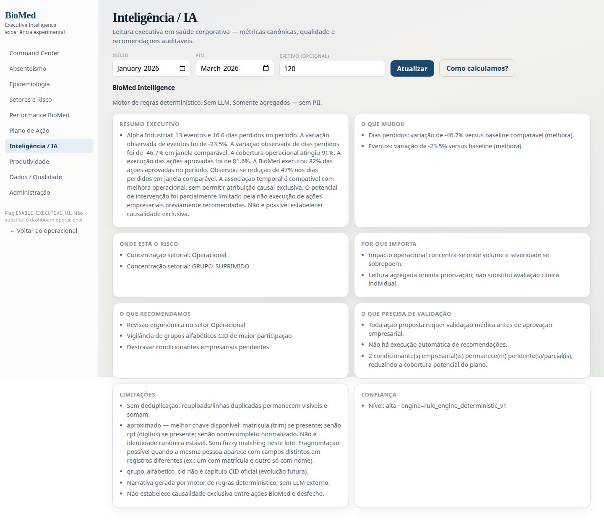

*Arquivo: `homolog_module_intelligence_1440x900.png`*

---

## Plano de Ação

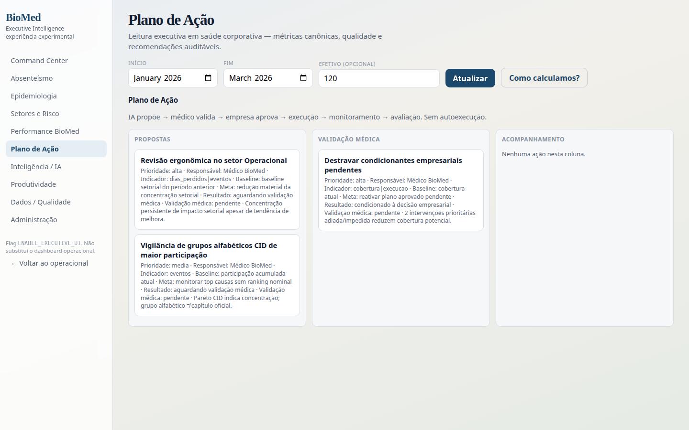

*Arquivo: `homolog_module_actions_1440x900.png`*

---

## Epidemiologia

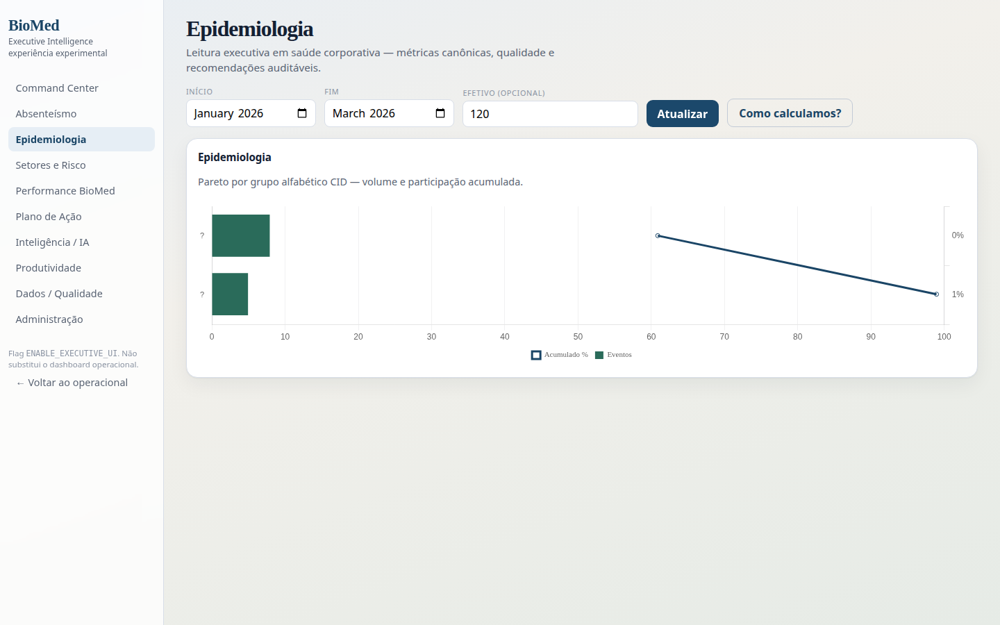

*Arquivo: `homolog_module_epidemiology_1440x900.png`*

---

## Setores

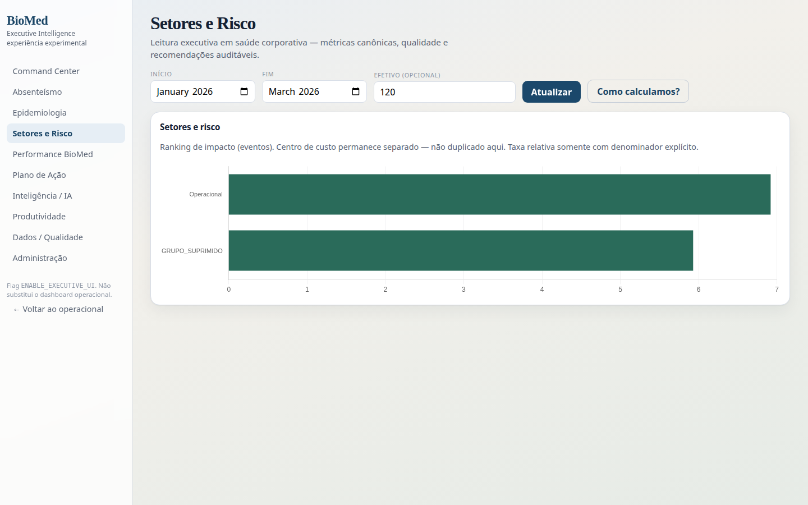

*Arquivo: `homolog_module_sectors_1440x900.png`*

---

## Qualidade dos Dados

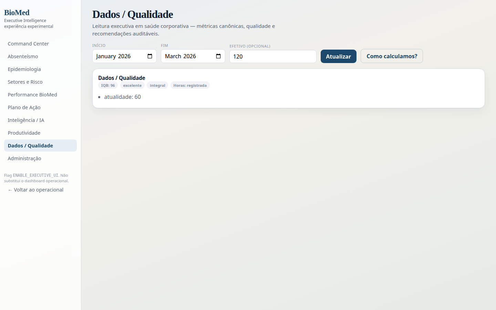

*Arquivo: `homolog_module_quality_1440x900.png`*

---

## Produtividade

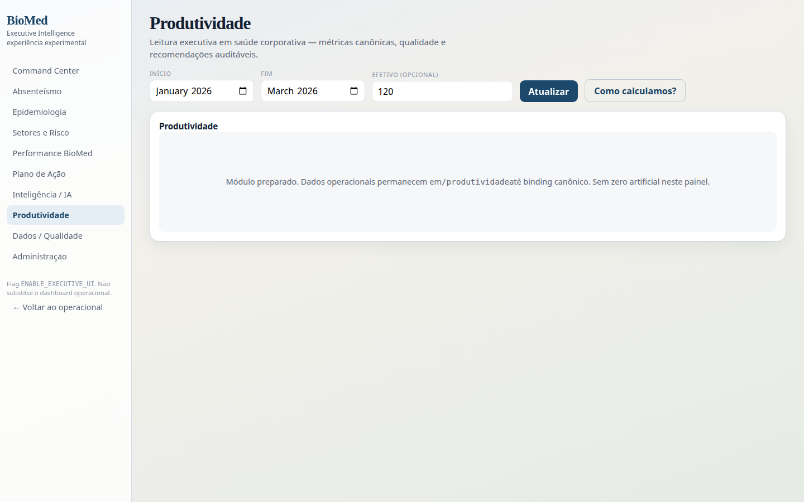

*Arquivo: `homolog_module_productivity_1440x900.png`*

---

## Comparativo Responsivo

### Mobile — 390×844

### Tablet — 768×1024

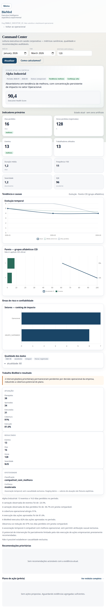

### Desktop — 1366×768

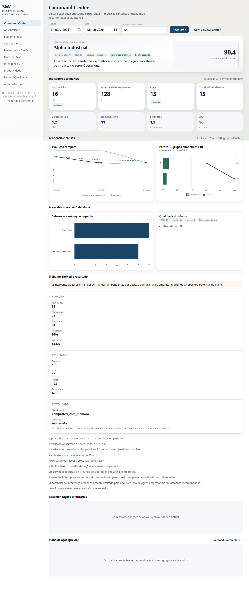

### Desktop — 1440×900

### Desktop — 1920×1080

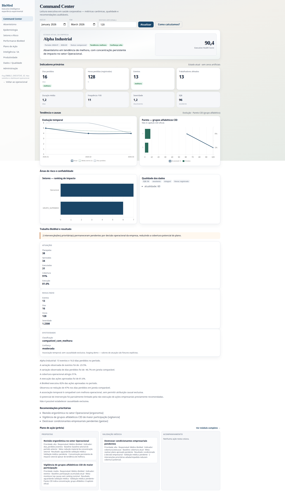

---

## Inventário completo (`homolog_*.png`)

- `homolog_command_1024x768.png` (460327 bytes)
- `homolog_command_1366x768.png` (477197 bytes)
- `homolog_command_1440x900.png` (582129 bytes)
- `homolog_command_1920x1080.png` (667805 bytes)
- `homolog_command_390x844.png` (462105 bytes)
- `homolog_command_768x1024.png` (416607 bytes)
- `homolog_module_absenteeism_1440x900.png` (226880 bytes)
- `homolog_module_actions_1440x900.png` (284666 bytes)
- `homolog_module_command_1440x900.png` (489147 bytes)
- `homolog_module_epidemiology_1440x900.png` (202781 bytes)
- `homolog_module_intelligence_1440x900.png` (372625 bytes)
- `homolog_module_performance_1440x900.png` (267250 bytes)
- `homolog_module_productivity_1440x900.png` (216623 bytes)
- `homolog_module_quality_1440x900.png` (234050 bytes)
- `homolog_module_sectors_1440x900.png` (202845 bytes)
